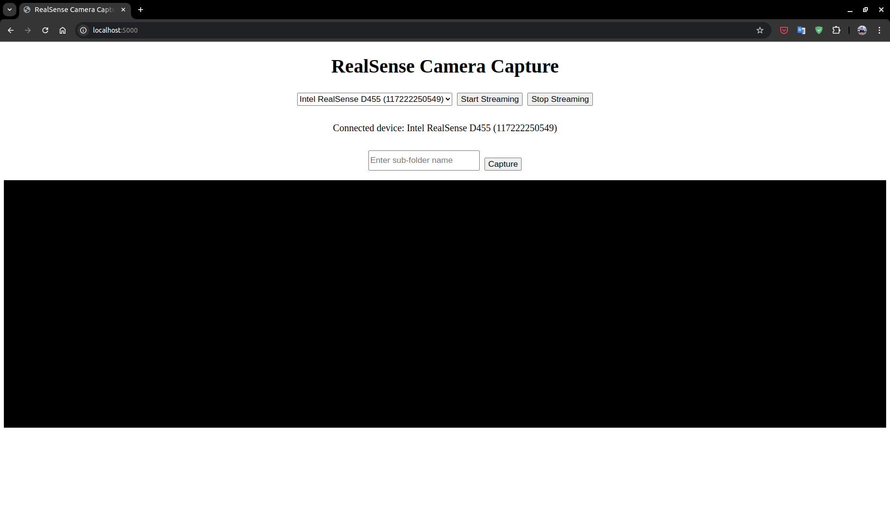
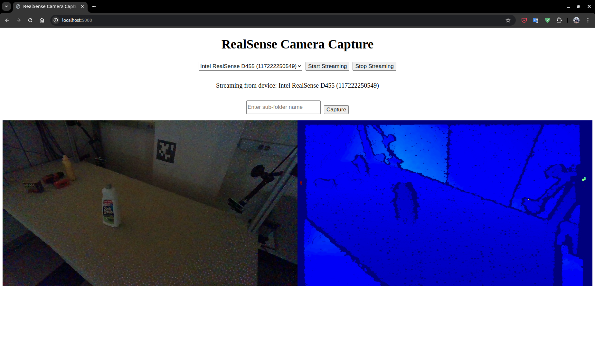
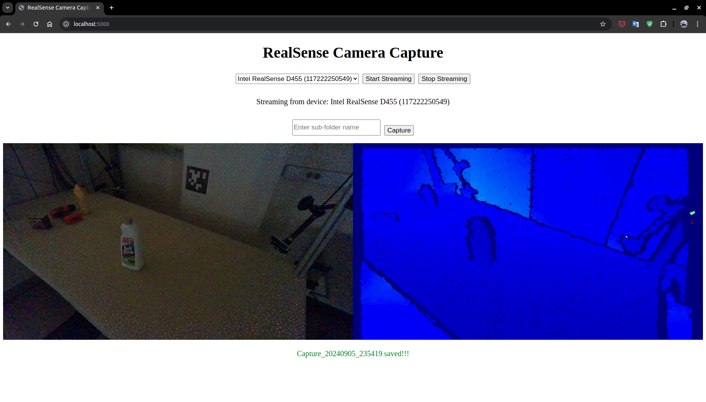
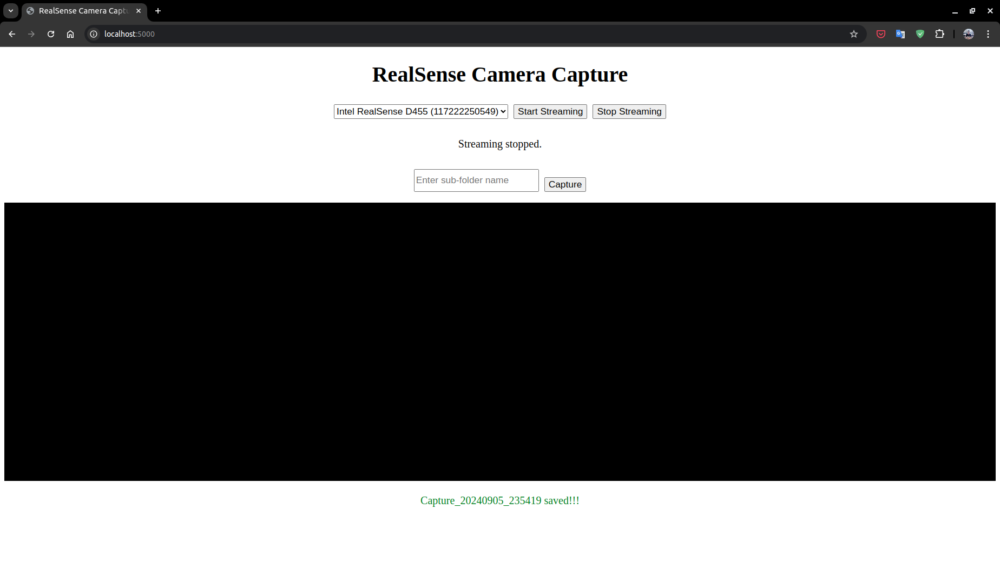

# RealSense Camera Capture Toolkit

## Table of Contents
- [RealSense Camera Capture Toolkit](#realsense-camera-capture-toolkit)
  - [Table of Contents](#table-of-contents)
  - [Installation](#installation)
  - [Clone Repository](#clone-repository)
  - [Usage](#usage)

## Installation

1. **Create Conda Environment**
   ```bash
   conda create -n rs-capture-toolkit python=3.10
   ```

2. **Activate Conda Environment**
   ```bash
   conda activate rs-capture-toolkit
   ```

3. **Install Dependencies**
   ```bash
   python -m pip install --no-cache-dir -r requirements.txt
   ```

## Clone Repository

Clone the repository and navigate to the project directory:

```bash
git clone --recursive git@github.com:gobanana520/realsense-capture-toolkit.git
cd realsense-capture-toolkit
```

## Usage

1. **Run the Script**

   Start the application by running:

   ```bash
   python app.py
   ```

   You should see the following output:

   ```
    * Serving Flask app 'RealSense Capture Toolkit'
    * Debug mode: off
   WARNING: This is a development server. Do not use it in a production deployment. Use a production WSGI server instead.
    * Running on all addresses (0.0.0.0)
    * Running on http://127.0.0.1:5000
    * Running on http://192.168.50.200:5000
   ```

2. **Access the Web Interface**

   Open your browser and go to `http://localhost:5000`. You should see the following page:

   

3. **Start Streaming**

   Select the camera and click on the `Start Streaming` button. The color and depth streaming frames will be displayed in the middle of the page:

   

4. **Capture Frames**

   Click the `Capture` button to capture the current frame. The captured images will be saved in the `capture/<sub-folder-name>` folder, and the capture status will be displayed at the bottom of the page:

   

5. **Stop Streaming**

   Click the `Stop Streaming` button to stop the camera stream:

   